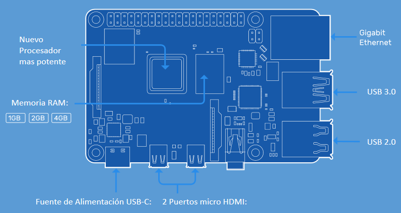

# Nodalog

_**Este proyecto está en desarrollo,** Bitácora módulo nodo Datalogger basado en una Raspberry PI 4._

## Comenzando 🚀


La idea es aprovechar las ventajas de la Raspberry PI 4 para levantar un LAMP para un aplicativo Datalogger con un cliente Modbus TCP/RTU.


### Especificaciones Técnicas 📋

* SoC Broadcom BCM2711, 4 nucleos Cortex-A72 (ARM v8) de 64 bits a 1.5GHz
* SDRAM LPDDR4-3200 de 1 GB, 2 GB o 4 GB (según el modelo) en este caso 2GB.
* Wifi 2.4GHz y 5.0GHz, Bluetooth 5.0 BLE y LAN Gigabit Ethernet
* 2 puertos USB 3.0 y 2 puertos USB 2.0.
* Headers GPIO estándar de 40 pines de Raspberry Pi (totalmente compatible con placas anteriores)
* 2 puertos micro-HDMI 4K
* Puerto de pantalla DSI, puerto de cámara CSI.
* Puerto de audio compuesto y video compuesto de 4 polos
* Gráficos OpenGL ES 3.0
* Ranura para tarjeta micro SD.
* Conector USB-C para la conexión de una fuente externa
* Alimentación a través de Ethernet habilitada (requiere un HAT PoE no incluido)
* Temperatura de funcionamiento: 0 – 50°C ambiente, se recomienda uso de disipadores

### Materiales / equipos Minimos 📑

* Raspberrry pi 4 2 GB.
* Tarjeta microSD 16GB clase10.
* Teclado, mouse, Monitor con entrada HDMI.
* adaptador HDMI a micro HDMI.
* Computador / Notebook para bajar y cargar la imagen ISO a la microSD.
* Adaptador microSD a USB. (En caso que el PC no tenga).



----------

## Instalación 🔧

_El paso a paso de lo realizado (y que funcionó) para dejar el entorno y sistema ejecutandose_

_**Paso inicial:** Instalación de la Raspberry desde WINDOWS:_


- Ingresa a la [Pagina Oficial de Raspberry PI](https://www.raspberrypi.org/downloads/), y te recomiendo seleccionar el [Raspberry Pi OS (Ex-Raspbian)](https://www.raspberrypi.org/downloads/raspberry-pi-os/)

- Elige el ISO [Raspberry Pi OS (32-bit) with desktop and recommended software](https://downloads.raspberrypi.org/raspios_full_armhf_latest)

- Descagar y descomprimir el ISO.

- Pasar el ISO a la tarjeta con su programa favorito.

- Conectar la Raspberry a la red LAN o WIFI y ver la IP

- Configurar el cliente remoto SSH para Windows [MobaXterm]

- Instalar las aplicaciones por consola 


**MariaDB**  
_Actualizamos los paquetes:_
```
sudo apt update
```

_Instalamos MariaDB ejecutando el siguiente comando__

```
sudo apt install mariadb-server
```

_Eliminamos la configuracion por defecto y problemas de seguridad, con el siguiente script que viene incluido en la instalación_

```
sudo mysql_secure_installation
```

**APACHE + PHP**  
_Expandimos el uso de la microSD, luego de ejecutar el comando indicado elegir la opcion 7 (advanced Options) y luego A1 (Expand Filesystem) :_
```
sudo raspi-config
```

_Actualizamos e instalamos los paquetes (dar Si(Yes) cuando pregunte)_

```
sudo apt update && sudo apt upgrade
```

_Instalamos APACHE2_

```
sudo apt install apache2
```

_Instalamos PHP 7.3_

```
sudo apt install php
```

_Reiniciamos el seervidor Apache_

```
sudo service apache2 restart
```


**phpMyAdmin**  
_Instalamos y elegimos la opcion apache2_ 
```
sudo apt install phpmyadmin
```
> Se debe aceptar la instalacion  dbconfig-common y asignar una clave

Y enlazamos phpmyadmin con mysql (mariaDB)
```
sudo phpenmod mysqli
```

_Reiniciamos_
```
sudo service apache2 restart
```


## Ejecutando pruebas iniciales ⚙️

_Por iniciar_


## Despliegue 📦

_Por inicar_

## Construido con 🛠️

_Herramientas utilizadas y en pruebas_

* [Usb Image Tool](https://www.alexpage.de/usb-image-tool/download/) - Quemador ISO usado.
* [MobaXterm](https://mobaxterm.mobatek.net/download-home-edition.html) - Conexión SSH y FTP.
* [Vnc Viewer](https://www.realvnc.com/es/connect/download/viewer/) - Conexión por escritorio remoto.
* Python 3.7.3 - Incluido en el ISO
* MariaDB


## Autores ✒️

_Todos aquellos que ayudaron a levantar el proyecto desde sus inicios_

* **Antonio Chávez V.** - *Idea y hardware* - [Antonio (Linkedin)](https://www.linkedin.com/in/antonio-sisep/)
* **German Varas** - *Bases de datos y PHP* - [German Varas](#)
* **Miguel** - *Carne de cañon* - [Miguel](#)

También puedes mirar la lista de todos los [contribuyentes](https://github.com/ElArroz/Nodalog/graphs/contributors) quíenes han participado en este proyecto. 
## Versiones 📌

Para todas las versiones disponibles, mira los [tags en este repositorio](https://github.com/ElArroz/Nodalog/tags).

## Licencia 📄
Este proyecto está bajo la Licencia (MIT License) - mira el archivo [LICENSE.md](https://github.com/ElArroz/Nodalog/blob/master/LICENSE) para detalles

## Expresiones de Gratitud 🎁

* Comenta a otros sobre este proyecto 📢
* Invita una cerveza 🍺 o un café ☕ a alguien del equipo. 
* Da las gracias públicamente 😎 
* etc.

